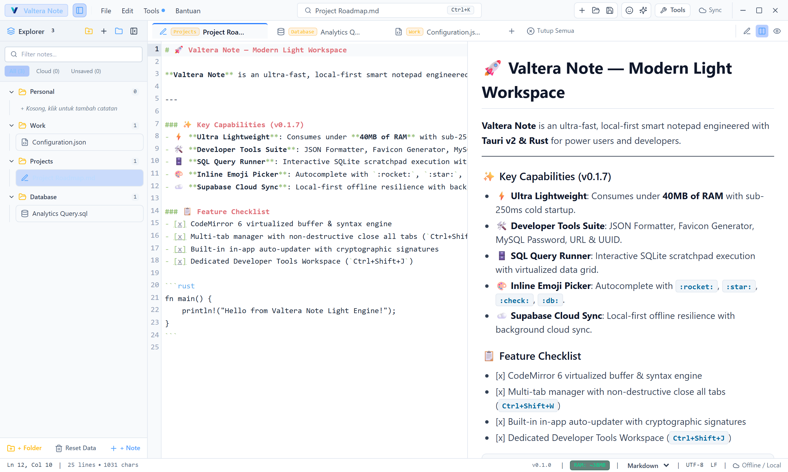

<div align="center">


# Valtera Note

**Editor teks desktop super-ringan, SQL scratchpad, workspace Markdown, rangkaian Developer Tools — kini dengan AI Assistant yang menjaga privasi.**
*Dibangun dengan Tauri v2 & Rust — konsumsi RAM di bawah 40MB.*

[](LICENSE)
[](https://v2.tauri.app)
[](https://www.rust-lang.org)
[](https://svelte.dev)
[](#-kenapa-valtera-note)
[](https://github.com/danikz/valtera-note/releases/latest)

<p align="center">
  <a href="README.md">🇬🇧 English</a> · <a href="README.id.md">🇮🇩 Bahasa Indonesia</a>
</p>

<br />

<p align="center">
  
</p>

</div>

---

## 📥 Unduh (Versi Terbaru)

Ambil installer resmi untuk platformmu dari **[Halaman GitHub Releases](https://github.com/danikz/valtera-note/releases/latest)** — Windows `.exe` / `.msi`, macOS `.dmg`, Linux `.deb` / `.AppImage`.

> 🔄 **Pembaruan Otomatis In-App**: Valtera Note dilengkapi auto-updater kriptografis. Saat versi baru dirilis, kamu langsung mendapat notifikasi dengan upgrade 1-klik.

---

## ✨ Sorotan Fitur

- 🤖 **AI Assistant bawaan** — sidebar chat yang membaca catatan aktif & teks terpilihmu. Bawa API key sendiri: **Anthropic Claude (native)** atau **endpoint OpenAI-compatible apa pun** (OpenAI, OpenRouter, Groq, Ollama lokal). Bahkan bisa menulis balik ke catatanmu. → [Panduan AI Assistant](docs/AI_ASSISTANT.md)
- 🔒 **Enkripsi End-to-End** — catatan dienkripsi XChaCha20-Poly1305 (derivasi kunci Argon2id) sebelum menyentuh disk lokal maupun cloud, dilengkapi lock screen & auto-unlock via Windows Credential Manager / Keychain.
- ⚡ **Startup Dingin Instan** — boot dalam `< 250ms`, konsumsi idle **di bawah 40MB RAM** (Tauri v2 + Rust, bukan Electron).
- 🛠️ **Rangkaian Developer Tools** — JSON Formatter & Tree, SQLite Studio, Favicon Package Generator, MySQL Password Hash, URL & UUID tools. → [Fitur Lengkap](docs/FEATURES.md)
- 📑 **Live Markdown Split** — GitHub Flavored Markdown dengan dual-pane tersinkron.
- 🗄️ **SQL Scratchpad** — syntax highlighting, SQL beautifier, eksekusi SQLite lokal dengan result grid.
- 🌳 **JSON Tree & Table Interaktif** — node bisa diciutkan, klik-untuk-salin path, ekspor CSV/Markdown.
- ☁️ **Offline-First + Cloud Sync Opsional** — berfungsi penuh tanpa internet; sinkronisasi Supabase opsional dengan Row Level Security ketat. → [Setup Supabase](docs/SUPABASE_SETUP.md)
- 🎨 **Tema Gelap / Terang / Sistem** — 6 palet editor (Tokyo Night, Dracula, GitHub Light, …) plus zona waktu tampilan yang bisa diatur (format 24 jam).
- 🪟 **Integrasi Windows Explorer** — buka file 1-klik langsung dari context menu.

---

## 🤖 AI Assistant (Bawa API Key Sendiri)

Tekan **`Ctrl+Shift+A`** (atau tombol ✨ di titlebar) untuk membuka sidebar chat AI:

- **Provider bebas**: Anthropic Claude (native) atau endpoint OpenAI-compatible apa pun — key & model diatur di *Pengaturan → AI Assistant*, tersimpan hanya di perangkatmu.
- **Sadar konteks**: aktifkan "Baca catatan aktif" agar AI paham isi catatan yang terbuka, dan "Sertakan teks terpilih" untuk bagian yang kamu blok.
- **Bisa menulis ke catatan**: minta AI menulis/mengubah isi catatan → terapkan satu klik (dengan konfirmasi, aman).
- **Aksi cepat**: Ringkas, Perbaiki Tulisan, Terjemahkan, Jelaskan, Commit Message, dan prompt kustom.

> ⚠️ Catatan privasi: teks yang dikirim ke AI keluar dari perangkat sebagai plaintext. Enkripsi E2E melindungi penyimpanan lokal & cloud — bukan permintaan AI. Untuk konten super-sensitif, gunakan provider lokal (Ollama).

📖 Panduan lengkap (setup provider, troubleshooting, contoh perintah): **[docs/AI_ASSISTANT.md](docs/AI_ASSISTANT.md)**

---

## ☁️ Cloud Sync (Opsional — Supabase)

Valtera Note 100% offline-first. Untuk sinkronisasi multi-perangkat, ikuti urutan terpandu ini di dalam app:

1. **Kredensial Project** — masukkan *Project URL* & *Anon Key* (Pengaturan → Supabase).
2. **Siapkan Tabel** — jalankan skrip SQL resmi dari SyncModal (Row Level Security ketat: hanya akun yang login bisa mengakses).
3. **Masuk / Daftar Akun** — sync berjalan sebagai identitasmu, sesi ditahan otomatis.

Setelah itu semua catatan tersinkron otomatis (1,5 detik setelah mengetik + pull berkala 30 detik).

📖 Panduan lengkap termasuk skrip SQL & troubleshooting: **[docs/SUPABASE_SETUP.md](docs/SUPABASE_SETUP.md)**

---

## 🔒 Keamanan & Enkripsi End-to-End

Catatanmu terenkripsi **zero-knowledge** — bahkan penyedia cloud tidak bisa membacanya.

| Lapisan | Yang terjadi |
| :--- | :--- |
| **Lokal (SQLite)** | Isi catatan disimpan sebagai ciphertext `enc:v1:...` — dienkripsi **sebelum** menyentuh disk. |
| **Derivasi kunci** | Master password → **Argon2id** (parameter OWASP) → kunci 256-bit. Password itu sendiri tidak pernah disimpan. |
| **Enkripsi** | **XChaCha20-Poly1305** authenticated encryption per catatan — kerahasiaan + integritas. |
| **Cloud sync (Supabase)** | Server hanya melihat ciphertext. Dengan RLS ketat, hanya akun login-mu yang bisa mengakses barismu. |
| **Lock screen** | Konten disembunyikan saat terkunci; "Ingat di Device Ini" menyimpan kunci di OS keystore (Windows Credential Manager / macOS Keychain / Linux Secret Service) — **bukan** passwordnya. |

**Batas yang jujur** (kami memilih over-explain daripada over-promise):

- Lupa master password = catatan **tidak bisa dibaca selamanya** — sengaja tidak ada pintu pemulihan.
- **Judul** catatan & nama folder tetap plaintext di cloud (hanya isinya yang terenkripsi).
- Teks yang dikirim ke **AI Assistant** keluar sebagai plaintext — gunakan provider lokal (Ollama) untuk konten paling sensitif.

---

## ⌨️ Pintasan Keyboard

| Aksi / Fitur | Pintasan |
| :--- | :--- |
| **AI Chat Sidebar** | `Ctrl + Shift + A` |
| **Command Palette & Pencarian** | `Ctrl + K` / `Ctrl + P` |
| **Pengaturan (Supabase, AI, Tema, Editor)** | `Ctrl + ,` |
| **Developer Tools (JSON)** | `Ctrl + Shift + J` |
| **SQLite Studio** | `Ctrl + Shift + D` |
| **Favicon Generator** | `Ctrl + Shift + F` |
| **MySQL Password Generator** | `Ctrl + Shift + P` |
| **Emoji & Icon Picker** | `Ctrl + Shift + E` |
| **Catatan Baru / Buka / Simpan** | `Ctrl + N` / `Ctrl + O` / `Ctrl + S` |
| **Toggle Sidebar Navigasi** | `Ctrl + B` |
| **Toggle Markdown Split View** | `Ctrl + \` |
| **Tutup Tab / Semua Tab** | `Ctrl + W` / `Ctrl + Shift + W` |
| **Eksekusi Query SQL** | `Ctrl + Enter` / `F5` |

---

## 🛠️ Build dari Source

### Prasyarat
- [Node.js](https://nodejs.org) (v20+) & [pnpm](https://pnpm.io) (v10+)
- [Rust](https://www.rust-lang.org) (1.75+)
- Prasyarat Tauri v2 per platform:
  - **Windows**: Microsoft C++ Build Tools & WebView2
  - **macOS**: Xcode Command Line Tools
  - **Linux**: `libwebkit2gtk-4.1-dev`, `build-essential`, `curl`, `libssl-dev`, `libayatana-appindicator3-dev`

```bash
# 1. Clone repository
git clone https://github.com/danikz/valtera-note.git
cd valtera-note

# 2. Instal dependensi & jalankan mode development
pnpm install
pnpm tauri dev

# 3. Compile installer native
pnpm tauri build
```

---

## 📚 Dokumentasi

| Dokumen | Isi |
| :--- | :--- |
| **[Panduan AI Assistant](docs/AI_ASSISTANT.md)** | Setup provider (Claude / OpenAI-compatible / Ollama), chat sidebar, konteks catatan, write-to-note, troubleshooting. |
| **[Setup Supabase](docs/SUPABASE_SETUP.md)** | Skrip SQL resmi (RLS ketat), urutan setup, login akun, troubleshooting sync. |
| **[Fitur & Pratinjau](docs/FEATURES.md)** | Tur lengkap semua fitur dengan screenshot. |
| **[Arsitektur](docs/ARCHITECTURE.md)** | Struktur teknis aplikasi (Tauri + Svelte + SQLite). |
| **[Skema Database](docs/DATABASE.md)** | Skema SQLite lokal & tabel cloud. |
| **[Changelog](CHANGELOG.md)** | Riwayat rilis per versi. |

## 📄 Lisensi

Didistribusikan di bawah **Lisensi MIT**. Lihat [`LICENSE`](LICENSE) untuk detailnya.

<div align="center">
  <sub>Dirancang & Dikembangkan oleh <b>PT Valtera Teknologi Digital</b></sub>
</div>
