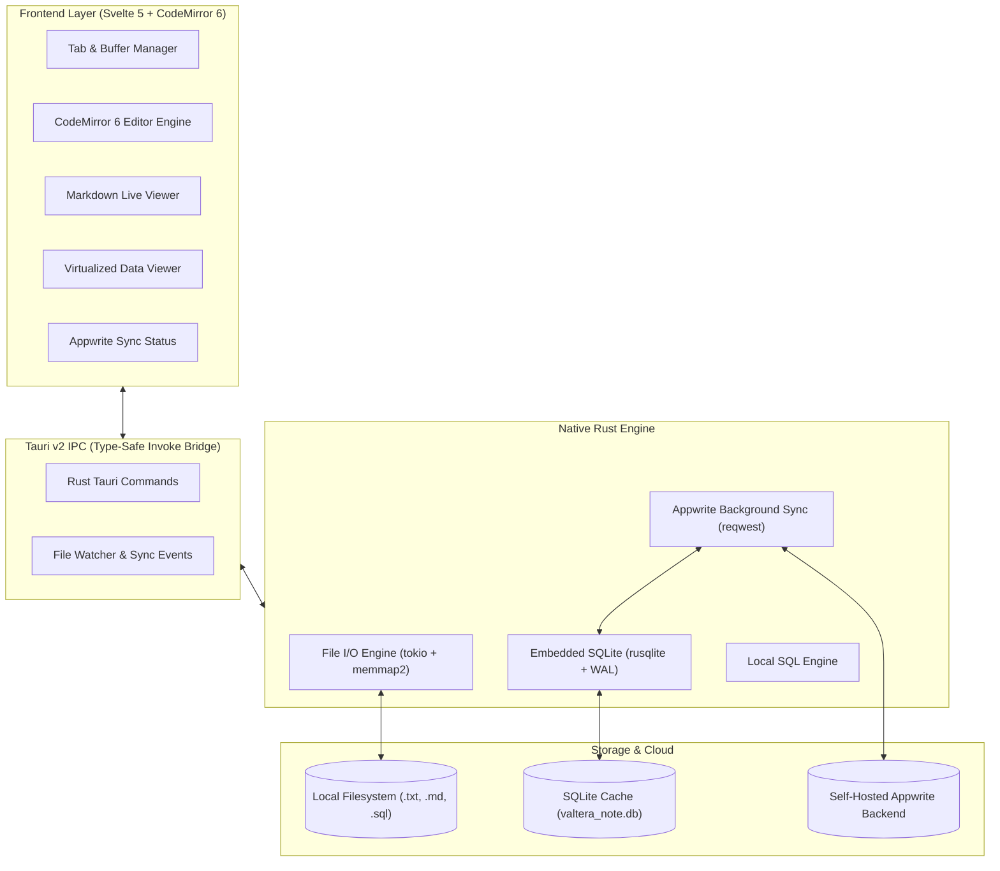

<div align="center">


# Valtera Note

**The ultra-lightweight, lightning-fast desktop text editor, SQL scratchpad, and Markdown viewer.**  
*Built with Tauri v2 & Rust — Consuming under 40MB of RAM.*

[](LICENSE)
[](https://v2.tauri.app)
[](https://www.rust-lang.org)
[](https://svelte.dev)
[](https://appwrite.io)
[](#-download--installation)
[](#-performance--resource-benchmark)

<p align="center">
  <a href="#-key-features">Features</a> •
  <a href="#-benchmarks--comparison">Benchmarks</a> •
  <a href="#-system-architecture">Architecture</a> •
  <a href="#-download--installation">Download</a> •
  <a href="#-self-hosted-cloud-sync-appwrite">Appwrite Sync</a> •
  <a href="#-ai-first-development">AI Roadmap</a> •
  <a href="#-documentation">Documentation</a>
</p>

</div>

---

## 💡 Why Valtera Note?

Most modern text editors (VS Code, Obsidian, Notion) are built on **Electron**, packaging an entire Chromium browser and Node.js runtime that consumes **400MB to 1GB+ of RAM** just to edit a small text or SQL file. Classic Notepad is lightweight but lacks tabs, syntax highlighting, and cloud sync.

**Valtera Note bridges this gap:**
- ⚡ **Instant cold boot (< 250ms)** & idle memory usage **under 40MB**.
- 📊 **SQL Dialect Highlighting & Formatter** with local SQLite scratchpad query execution.
- 📑 **Live Markdown Split-Viewer** with GitHub Flavored Markdown (GFM) and zero-lag sync scroll.
- ☁️ **Self-Hostable Open-Source Sync** powered by **Appwrite** (Local-First, 100% offline-capable).
- 🪟 **True Cross-Platform** support for **Windows 10/11** and **Linux (X11 & Wayland)**.

---

## 📊 Benchmarks & Comparison

| Feature / Metric | 📝 **Valtera Note** | 📄 Classic Notepad | 💻 VS Code | 🔮 Obsidian (Electron) |
| :--- | :---: | :---: | :---: | :---: |
| **Idle Memory (RAM)** | **~38 MB** | ~15 MB | ~350 MB - 600 MB | ~280 MB - 500 MB |
| **Cold Startup Time** | **< 250 ms** | < 150 ms | ~1,800 ms | ~1,500 ms |
| **Binary Installer Size**| **< 12 MB** | Built-in | ~95 MB | ~85 MB |
| **Markdown Live Viewer**| **✅ Built-in** | ❌ No | ⚠️ Plugin required | ✅ Built-in |
| **SQL Highlighting & Run**| **✅ Built-in** | ❌ No | ⚠️ Plugin required | ❌ No |
| **Multi-tab & Auto-Save**| **✅ Built-in** | ⚠️ Windows 11 only | ✅ Built-in | ✅ Built-in |
| **Self-Hosted Cloud Sync**| **✅ Appwrite** | ❌ OneDrive only | ⚠️ Settings only | 💰 Paid / Third-party |
| **Offline Resilience** | **✅ 100% Local First**| ✅ 100% Local | ✅ Local | ⚠️ Plugin dependent |

---

## ✨ Key Features

### 1. ⚡ Ultra-Fast Text & Buffer Engine
- Minimalist tab manager with persistent session state and crash recovery.
- Automatic charset detection (`UTF-8`, `UTF-16`, `ASCII`, `Windows-1252`) and line ending switching (`LF` / `CRLF`).
- Powered by **CodeMirror 6** for virtualized DOM rendering (only visible lines are mounted in memory).

### 2. 🗄️ SQL Scratchpad & Formatter
- Syntax highlighting for ANSI SQL, PostgreSQL, MySQL, SQLite, and T-SQL.
- Instant query beautification/formatting.
- Built-in lightweight SQLite query runner to explore local `.sqlite` or `.db` files in a virtualized data grid.

### 3. 📝 Live Markdown Preview & Reader Mode
- GitHub Flavored Markdown (tables, task lists, code fences, blockquotes).
- Three view modes: *Editor Only*, *Split View (Synchronized Scroll)*, and *Reader Mode*.
- Sanitized HTML preview via `DOMPurify` to guarantee zero-risk XSS execution.

### 4. ☁️ Self-Hostable Cloud Sync (Appwrite)
- **Local-First**: Works immediately offline using embedded SQLite 3.
- **Custom Backend**: Connect to [Appwrite Cloud](https://cloud.appwrite.io) or your own **self-hosted Docker instance**.
- **Background Sync**: Network sync runs asynchronously in native Rust threads (`tokio`), keeping the UI silky smooth.

---

## 🏗️ System Architecture



---

## 📥 Download & Installation

### Pre-Built Binaries (Releases)

Download the latest release for your operating system from the [Releases Page](https://github.com/valtera-teknologi/valtera-note/releases):

| OS | Package Format | Architecture |
| :--- | :--- | :--- |
| **Windows** | `.msi` (Installer) / `.exe` (NSIS) / Portable `.zip` | x64, ARM64 |
| **Linux (Ubuntu / Debian)** | `.deb` | x86_64, aarch64 |
| **Linux (Universal)** | `.AppImage` / `.tar.gz` | x86_64 |
| **Linux (Fedora / RHEL)** | `.rpm` | x86_64 |

---

## 🛠️ Building from Source

### Prerequisites
- **Node.js**: `v20+` & `pnpm` (or `npm`)
- **Rust**: `v1.75+` (`rustup update stable`)
- **Linux Build Dependencies** (Ubuntu/Debian):
  ```bash
  sudo apt update
  sudo apt install libwebkit2gtk-4.1-dev build-essential curl wget file libxdo-dev libssl-dev libayatana-appindicator3-dev librsvg2-dev
  ```

### Quick Start

```bash
# 1. Clone the repository
git clone https://github.com/valtera-teknologi/valtera-note.git
cd valtera-note

# 2. Install frontend dependencies
pnpm install

# 3. Run in development mode (Live Reload)
pnpm tauri dev

# 4. Build production package
pnpm tauri build
```

---

## ☁️ Self-Hosted Cloud Sync (Appwrite)

Valtera Note works out-of-the-box offline. To enable cloud synchronization across all your computers:

1. **Deploy Appwrite** (via Docker Compose):
   ```bash
   docker run -it --rm \
     --volume /var/run/docker.sock:/var/run/docker.sock \
     --volume "$(pwd)"/appwrite:/usr/src/code/appwrite:rw \
     --entrypoint="install" \
     appwrite/appwrite:1.6.0
   ```
2. In your **Appwrite Console**, create a project (e.g. `valtera-note`) and database according to [docs/APPWRITE_SETUP.md](docs/APPWRITE_SETUP.md).
3. In **Valtera Note** -> Open **Settings (⚙️)** -> **Cloud Sync**:
   - **Endpoint**: `https://appwrite.yourdomain.com/v1` (or `https://cloud.appwrite.io/v1`)
   - **Project ID**: `valtera-note`
   - Log in with your email & password.

---

## 📚 Documentation & Specifications

This repository is engineered to be **100% AI-extensible and strictly typed**. Detailed documentation:

- 📄 [**PRD.md**](docs/PRD.md) — *Product Requirements Document, Personas, and NFRs*
- 🏗️ [**ARCHITECTURE.md**](docs/ARCHITECTURE.md) — *Tauri v2 IPC Contracts, Memory Optimization, & Component Tree*
- ☁️ [**APPWRITE_SETUP.md**](docs/APPWRITE_SETUP.md) — *Complete Collection Schemas, Permissions, & Docker Setup*
- 🗄️ [**SCHEMA.dbml**](docs/SCHEMA.dbml) — *Database Markup Language Schema*
- 💾 [**DATABASE.md**](docs/DATABASE.md) — *SQLite DDL, Indices, and Persistence Strategy*
- 🤖 [**AI_DEVELOPMENT_GUIDE.md**](docs/AI_DEVELOPMENT_GUIDE.md) — *Modular Prompts for AI Coding Agents*

---

## 🗺️ Project Roadmap & AI Milestones

- [x] **Milestone 0**: System Architecture, PRD, DBML, & Appwrite Spec.
- [ ] **Milestone 1**: Tauri v2 + Svelte 5 + Tailwind CSS v4 Scaffold.
- [ ] **Milestone 2**: Rust Native File I/O Engine (`encoding_rs` + `tokio`).
- [ ] **Milestone 3**: Local SQLite Cache & Crash Recovery (`rusqlite` WAL).
- [ ] **Milestone 4**: CodeMirror 6 Multi-Tab Editor Core.
- [ ] **Milestone 5**: Live Markdown Split-Viewer & SQL Scratchpad Runner.
- [ ] **Milestone 6**: Rust Appwrite Asynchronous Sync Engine.
- [ ] **Milestone 7**: Cross-Platform Packaging (`.msi`, `.AppImage`, `.deb`).

---

## 🤝 Contributing

Contributions, issues, and feature requests are welcome!  
Feel free to check the [issues page](https://github.com/valtera-teknologi/valtera-note/issues).

1. Fork the Project
2. Create your Feature Branch (`git checkout -b feature/AmazingFeature`)
3. Commit your Changes (`git commit -m 'Add some AmazingFeature'`)
4. Push to the Branch (`git push origin feature/AmazingFeature`)
5. Open a Pull Request

---

## 📄 License

Distributed under the **MIT License**. See [`LICENSE`](LICENSE) for more information.

---

<div align="center">
  <sub>Maintained with ❤️ by <b>Valtera Teknologi Digital</b></sub>
</div>
