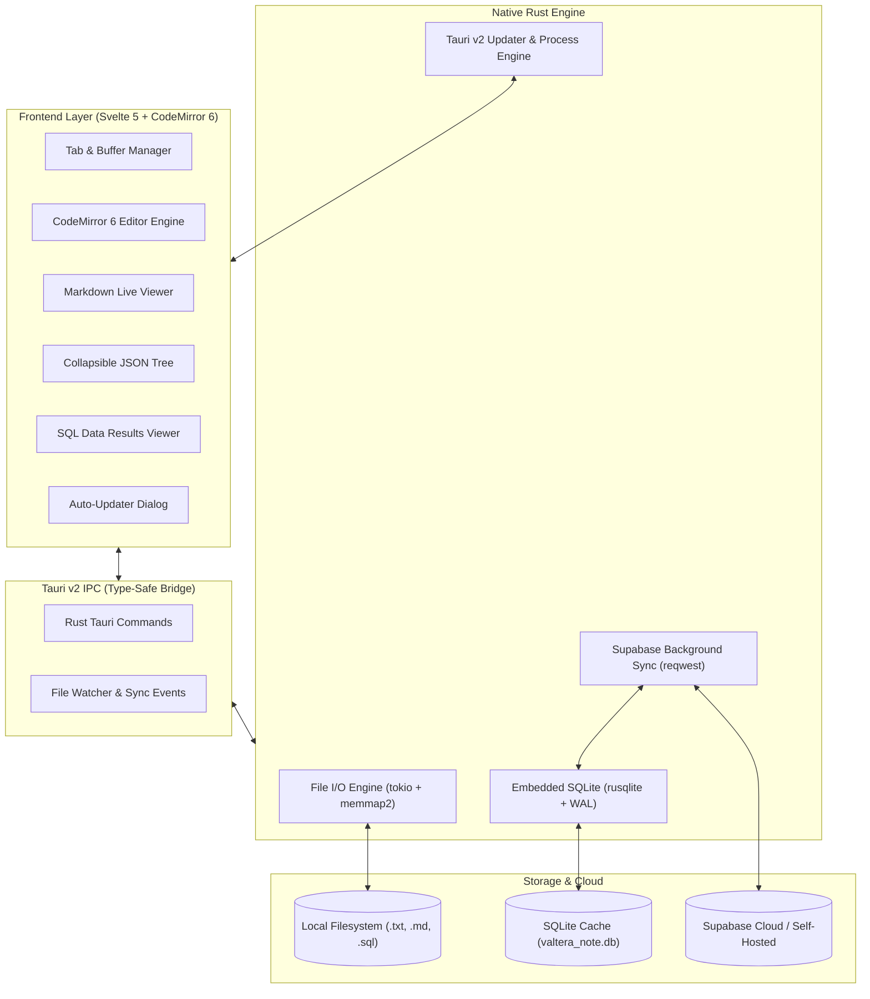

<div align="center">


# Valtera Note

**Ultra-lightweight, lightning-fast desktop text editor, SQL scratchpad, and Markdown workspace.**  
*Engineered with Tauri v2 & Rust — Consuming under 40MB of RAM.*

[](LICENSE)
[](https://v2.tauri.app)
[](https://www.rust-lang.org)
[](https://svelte.dev)
[](https://supabase.com)
[](#-performance--resource-benchmark)
[](https://github.com/danikz/valtera-note/releases)

<p align="center">
  <a href="#-why-valtera-note">Why Valtera Note</a> •
  <a href="#-benchmarks--comparison">Benchmarks</a> •
  <a href="#-key-features">Key Features</a> •
  <a href="#-keyboard-shortcuts">Shortcuts</a> •
  <a href="#-download--installation">Download</a> •
  <a href="#-cloud-sync-supabase">Supabase Sync</a> •
  <a href="#-auto-updater-system">Auto-Updater</a> •
  <a href="#-system-architecture">Architecture</a> •
  <a href="#-building-from-source">Build</a>
</p>

</div>

---

## 💡 Why Valtera Note?

Most modern text editors and note applications (VS Code, Obsidian, Notion) are built on **Electron**, bundling an entire Chromium browser and Node.js runtime that consumes **400MB to 1GB+ of RAM** just to edit a quick text file or run a SQL query. Classic Windows Notepad is lightweight but lacks tabs, syntax highlighting, live viewers, and cloud sync.

**Valtera Note delivers the best of both worlds:**
- ⚡ **Instant cold startup (< 250ms)** & idle memory usage **under 40MB**.
- 📊 **SQL Dialect Runner & Formatter** with embedded SQLite query execution.
- 📑 **Live Markdown Split-Viewer** with GitHub Flavored Markdown (GFM) and synced scroll.
- 🌳 **Interactive Collapsible JSON Tree Viewer** with direct node path copying.
- ☁️ **Self-Hostable Open-Source Sync** powered by **Supabase** (100% offline-first).
- 🔄 **Built-in Seamless Auto-Updater** to automatically keep all installations up to date.
- 🪟 **True Windows Integration**: Single-instance file opening and 1-click Explorer context menu registration.

---

## 📊 Benchmarks & Comparison

| Feature / Metric | 📝 **Valtera Note** | 📄 Classic Notepad | 💻 VS Code | 🔮 Obsidian |
| :--- | :---: | :---: | :---: | :---: |
| **Idle Memory (RAM)** | **~38 MB** | ~15 MB | ~350 MB - 600 MB | ~280 MB - 500 MB |
| **Cold Startup Time** | **< 250 ms** | < 150 ms | ~1,800 ms | ~1,500 ms |
| **Binary Installer Size**| **< 12 MB** | Built-in | ~95 MB | ~85 MB |
| **Markdown Live Viewer**| **✅ Built-in** | ❌ No | ⚠️ Plugin required | ✅ Built-in |
| **Interactive JSON Tree**| **✅ Built-in** | ❌ No | ⚠️ Plugin required | ❌ No |
| **SQL Highlighting & Run**| **✅ Built-in** | ❌ No | ⚠️ Plugin required | ❌ No |
| **Multi-tab & Auto-Save**| **✅ Built-in** | ⚠️ Win 11 only | ✅ Built-in | ✅ Built-in |
| **Self-Hosted Cloud Sync**| **✅ Supabase** | ❌ OneDrive only | ⚠️ Settings only | 💰 Paid Sync |
| **In-App Auto Updater**| **✅ Built-in** | ❌ Store only | ✅ Built-in | ✅ Built-in |
| **Offline Resilience** | **✅ 100% Local First**| ✅ 100% Local | ✅ Local | ⚠️ Plugin dependent |

---

## ✨ Key Features

### 1. ⚡ Virtualized Code & Text Engine
- Powered by **CodeMirror 6** for virtualized DOM rendering (only visible lines are mounted in memory).
- Minimalist tab manager with persistent session state and crash recovery.
- Automatic charset detection (`UTF-8`, `UTF-16`, `ASCII`, `Windows-1252`) and line ending switching (`LF` / `CRLF`).
- Non-destructive tab closing with permanent deletion protection.

### 2. 🗄️ SQL Scratchpad & Formatter
- Syntax highlighting for ANSI SQL, PostgreSQL, MySQL, SQLite, and T-SQL.
- Instant query beautification/formatting.
- Built-in lightweight SQLite query runner to explore local `.sqlite` or `.db` files in a virtualized data grid.

### 3. 🌳 Collapsible JSON Tree Viewer
- Switch from raw JSON text into an interactive, expandable tree node graph.
- Type badges for `String`, `Number`, `Boolean`, `Array`, and `Object`.
- Click-to-copy JSON paths (e.g. `data.users[0].email`).
- Bulk Expand All / Collapse All actions.

### 4. 📝 Live Markdown Preview & Reader Mode
- GitHub Flavored Markdown (GFM) with tables, task lists, code fences, and blockquotes.
- Three view modes: *Editor Only*, *Split View (Synchronized Scroll)*, and *Reader Mode*.
- Sanitized HTML preview via `DOMPurify` to guarantee zero-risk XSS execution.

### 5. ☁️ Self-Hostable Cloud Sync (Supabase)
- **Local-First**: Works immediately offline using embedded SQLite 3 cache.
- **Custom Backend**: Connect to [Supabase Cloud](https://supabase.com) or your own **self-hosted Docker instance**.
- **Background Sync**: Network sync runs asynchronously in native Rust threads (`tokio`), keeping the UI silky smooth.

### 6. 🔄 Integrated Auto-Updater
- Automatic update detection on application launch.
- Glassmorphic modal with release notes, download progress bar, and 1-click restart.
- Cryptographically signed packages with Ed25519 signatures.

---

## ⌨️ Keyboard Shortcuts

| Action | Shortcut |
| :--- | :--- |
| **Command Palette** | `Ctrl + K` / `Ctrl + P` |
| **New Note / Tab** | `Ctrl + N` |
| **Open File** | `Ctrl + O` |
| **Save Document** | `Ctrl + S` |
| **Close Active Tab** | `Ctrl + W` |
| **Toggle Sidebar** | `Ctrl + B` |
| **Toggle Split View** | `Ctrl + \` |
| **Toggle Reader Mode** | `Ctrl + Shift + P` |
| **Quick Snippets Drawer** | `Ctrl + Shift + S` |
| **Execute SQL Query** | `Ctrl + Enter` / `F5` |
| **Format SQL / JSON** | `Ctrl + Shift + F` |
| **Supabase Cloud Sync** | `Ctrl + Shift + U` |

---

## 📥 Download & Installation

### Pre-Built Binaries (Releases)

Download the latest production installers from the [GitHub Releases Page](https://github.com/danikz/valtera-note/releases):

| Platform | Installer Package | Architecture | Description |
| :--- | :--- | :---: | :--- |
| **Windows** | `Valtera Note_0.1.0_x64-setup.exe` | x64 | NSIS Standard Installer |
| **Windows** | `Valtera Note_0.1.0_x64_en-US.msi` | x64 | WiX Windows Enterprise MSI |
| **Linux** | `valtera-note_0.1.0_amd64.deb` | x64 | Debian / Ubuntu Package |
| **Linux** | `valtera-note_0.1.0_amd64.AppImage`| x64 | Standalone Universal AppImage |

---

## ☁️ Cloud Sync (Supabase Setup)

Valtera Note works 100% offline out-of-the-box. To enable multi-device sync:

1. **Create a Supabase Project** at [supabase.com](https://supabase.com) (or self-host via Docker).
2. Execute the schema migration in your Supabase **SQL Editor** from [docs/SUPABASE_SETUP.md](docs/SUPABASE_SETUP.md):
   ```sql
   create table if not exists public.valtera_notes (
     id uuid default gen_random_uuid() primary key,
     user_id uuid references auth.users(id) on delete cascade not null,
     title text not null default 'Untitled',
     content text not null default '',
     folder_path text not null default '',
     file_extension text not null default 'md',
     is_pinned boolean not null default false,
     tags text[] default '{}',
     created_at timestamptz default now() not null,
     updated_at timestamptz default now() not null
   );
   ```
3. Open **Valtera Note** ➔ Click **Cloud Sync (☁️)** in the Titlebar or press `Ctrl+Shift+U`.
4. Enter your **Project URL** and **Anon Key**, then sign up or log in.

---

## 🔄 Auto-Updater System

Valtera Note comes with an automated release and update pipeline.

### For Developers (Releasing an Update):
1. Bump the version number in `package.json`, `src-tauri/tauri.conf.json`, and `src-tauri/Cargo.toml`.
2. Add your `TAURI_SIGNING_PRIVATE_KEY` secret to GitHub Repository Settings.
3. Push a Git release tag:
   ```bash
   git tag v0.1.1
   git push origin main --tags
   ```
4. GitHub Actions will automatically compile, sign, and publish the release with `latest.json`.

### For End-Users:
- When an update is published, users will receive an in-app update notification with changelog and a 1-click update button.

---

## 🏗️ System Architecture



---

## 🛠️ Building from Source

### Prerequisites
- [Node.js](https://nodejs.org/) (v20+) & [pnpm](https://pnpm.io/)
- [Rust](https://www.rust-lang.org/) (v1.75+)
- Visual Studio C++ Build Tools (Windows) / `build-essential` & `libwebkit2gtk-4.1-dev` (Linux)

### Development Mode

```bash
# 1. Clone the repository
git clone https://github.com/danikz/valtera-note.git
cd valtera-note

# 2. Install dependencies
pnpm install

# 3. Run development server (Live-reload frontend + Rust backend)
pnpm tauri dev
```

### Production Build

```bash
# Compile and build native installers (.exe, .msi, .deb, .AppImage)
pnpm tauri build
```

---

## 📚 Technical Documentation

Detailed specifications and architecture blueprints:
- 📄 [**PRD.md**](docs/PRD.md) — *Product Requirements Document & User Personas*
- 🏗️ [**ARCHITECTURE.md**](docs/ARCHITECTURE.md) — *Tauri v2 IPC Contracts & Component Design*
- ☁️ [**SUPABASE_SETUP.md**](docs/SUPABASE_SETUP.md) — *PostgreSQL DDL, Row-Level Security, & Auth*
- 💾 [**DATABASE.md**](docs/DATABASE.md) — *Embedded SQLite Persistence Strategy*
- 📜 [**CHANGELOG.md**](CHANGELOG.md) — *Version History and Release Notes*

---

## 🤝 Contributing

Contributions, issues, and feature requests are welcome!  
Feel free to check the [issues page](https://github.com/danikz/valtera-note/issues).

---

## 📄 License

Distributed under the **MIT License**. See [`LICENSE`](LICENSE) for more details.

---

<div align="center">
  <sub>Engineered with ❤️ by <b>PT Valtera Teknologi Digital</b></sub>
</div>
