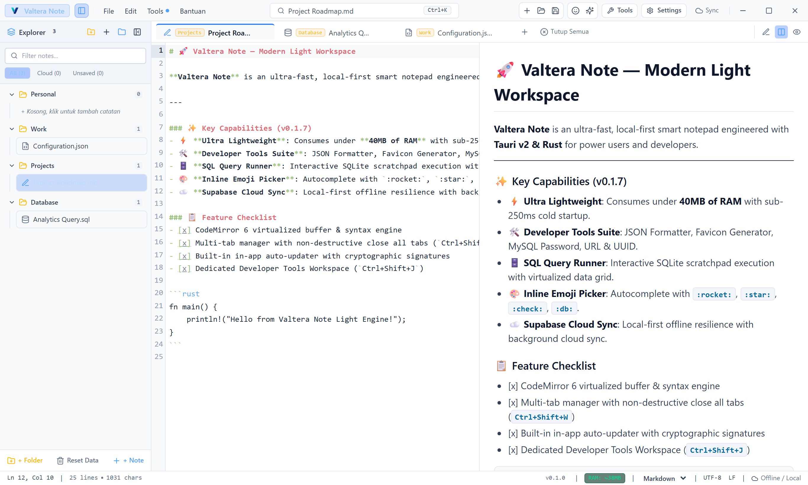
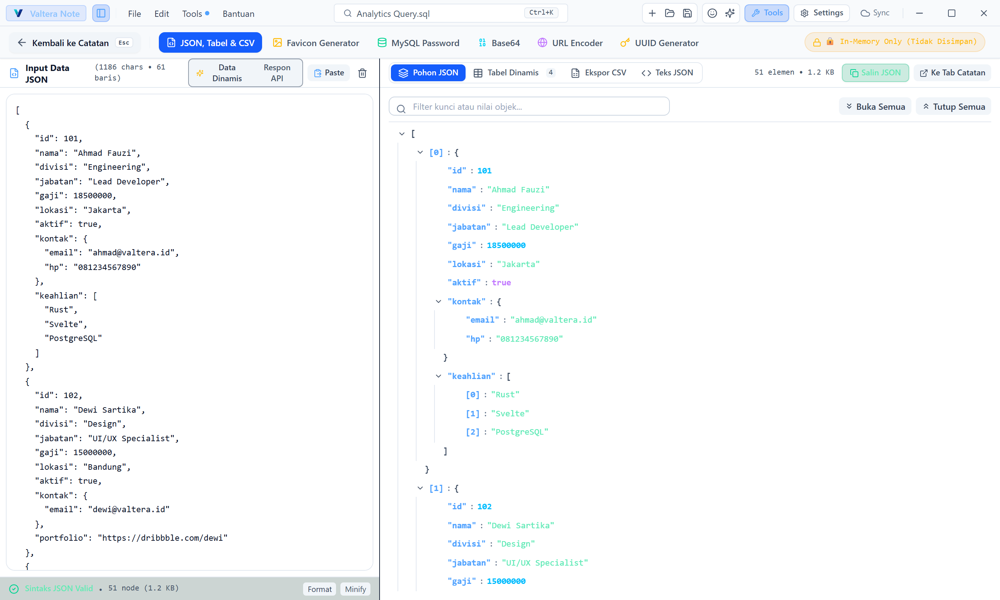
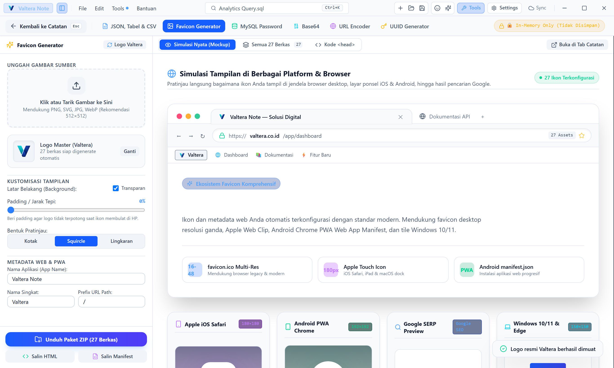
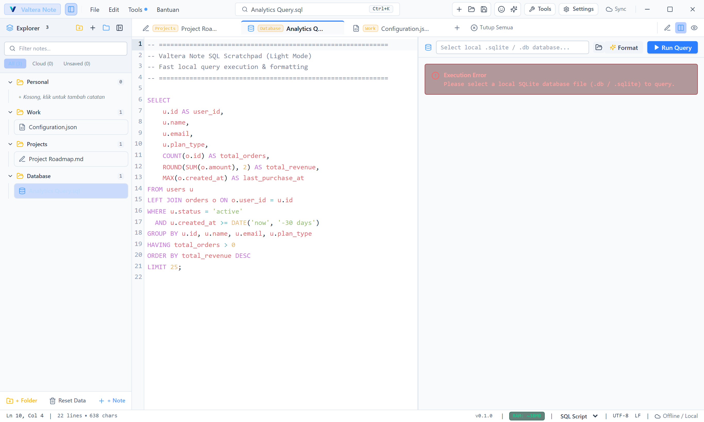
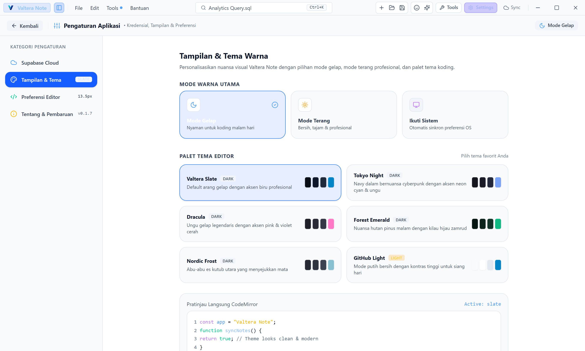
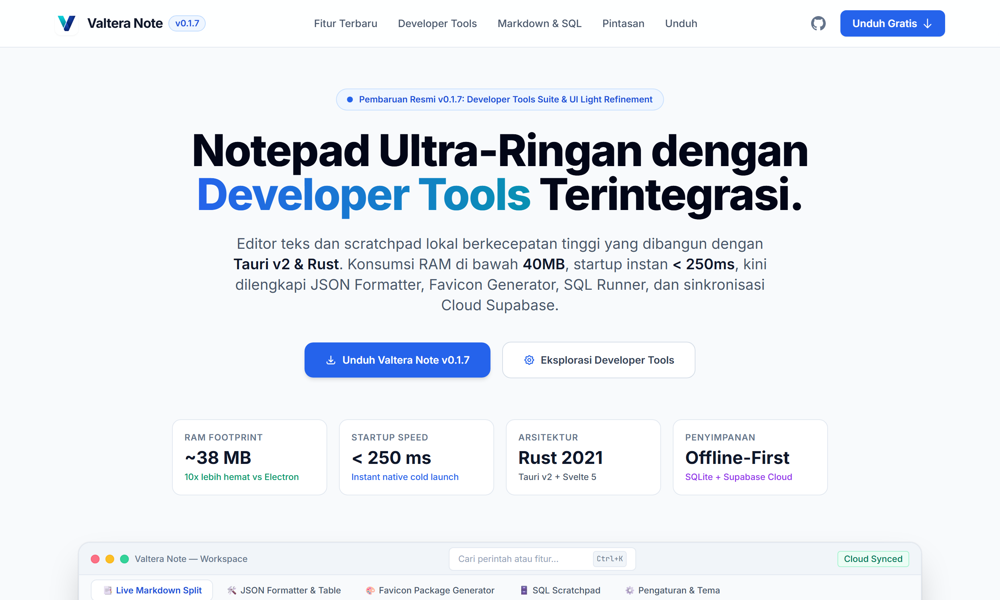

<div align="center">


# Valtera Note

**Ultra-lightweight desktop text editor, SQL scratchpad, Markdown workspace, and Developer Tools suite.**  
*Engineered with Tauri v2 & Rust — Consuming under 40MB of RAM.*

[](LICENSE)
[](https://v2.tauri.app)
[](https://www.rust-lang.org)
[](https://svelte.dev)
[](#-why-valtera-note)
[](https://github.com/danikz/valtera-note/releases)

<br />

<p align="center">
  
</p>

<p align="center">
  <a href="docs/index.html"><strong>🌐 Buka Halaman Dokumentasi & Showcase Fitur Interaktif (docs/index.html) →</strong></a>
</p>

</div>

---

## 📥 Download & Installation (v0.1.7)

Download the official installers directly from the **[GitHub Releases Page](https://github.com/danikz/valtera-note/releases/latest)**:

| Platform | Architecture / Format | Installer File |
| :--- | :--- | :--- |
| **Windows 10 / 11** | `.exe` (Standard Setup) | [**Valtera Note_0.1.7_x64-setup.exe**](https://github.com/danikz/valtera-note/releases/latest) |
| **Windows (Enterprise)** | `.msi` (WiX Installer) | [**Valtera Note_0.1.7_x64_en-US.msi**](https://github.com/danikz/valtera-note/releases/latest) |
| **macOS (Apple Silicon & Intel)** | `.dmg` (Universal Binary) | [**Valtera Note_0.1.7_universal.dmg**](https://github.com/danikz/valtera-note/releases/latest) |
| **Linux (Ubuntu / Debian)** | `.deb` (amd64) | [**valtera-note_0.1.7_amd64.deb**](https://github.com/danikz/valtera-note/releases/latest) |
| **Linux (Universal)** | `.AppImage` (x86_64) | [**valtera-note_0.1.7_amd64.AppImage**](https://github.com/danikz/valtera-note/releases/latest) |

> 🔄 **Automatic In-App Updates**: Valtera Note comes with a built-in cryptographic auto-updater. When a new version is released, you will receive an instant notification with 1-click upgrade.

---

## 💡 Why Valtera Note?

Most modern editors (VS Code, Obsidian, Notion) are built on **Electron**, consuming **400MB to 1GB+ of RAM** just to edit a quick text file or format JSON. Classic Notepad is lightweight but lacks tabs, live viewers, syntax highlighting, and modern developer utilities.

- ⚡ **Instant Cold Startup**: Boot in `< 250ms` and idle memory footprint **under 40MB of RAM**.
- 🛠️ **Built-in Developer Tools Suite**: JSON Formatter, Favicon Package Generator, MySQL Password, URL & UUID tools directly in-app.
- 📑 **Live Markdown Split**: GitHub Flavored Markdown (GFM) with synchronized dual-pane scrolling.
- 🗄️ **SQL Scratchpad**: Syntax highlighting, query beautifier, and local SQLite execution with result grid.
- ✨ **Inline Emoji & Icon Autocomplete**: Type `:rocket:`, `:star:`, `:check:` directly in the editor buffer.
- 🌳 **Interactive JSON Tree & Table**: Collapsible nodes, type badges, click-to-copy paths, and CSV/Markdown export.
- ☁️ **Offline-First & Cloud Sync**: 100% functional without internet; optional Supabase cloud sync for multi-device workflows.
- 🪟 **Windows Explorer Integration**: Open files with 1-click directly from the Windows context menu.

---

## ✨ Features & Previews (Light Mode)

### 1. 🛠️ Dedicated Developer Tools Suite (New in v0.1.7)
Access full-page developer utilities directly via the Titlebar button, Command Palette (`Ctrl+K`), or keyboard shortcuts:
- **JSON Formatter & Tree Inspector** (`Ctrl+Shift+J`): Beautify, minify, and inspect JSON payloads with interactive tree navigation or dynamic table grids. Export to **CSV (RFC 4180)** and **Markdown Tables** with 1-click.
- **Favicon & Web Icon Package Generator** (`Ctrl+Shift+F`): Drag and drop any image or SVG to generate `favicon.ico` (multi-res 16/32/48), `apple-touch-icon.png`, `android-chrome-192/512`, `manifest.json`, `browserconfig.xml`, and a ready-to-download ZIP archive.
- **MySQL Password Hash Generator** (`Ctrl+Shift+P`): Compute MySQL Native Password (`mysql_native_password` double-SHA1) and legacy hashes for quick database administration.
- **Base64 & URL Tools**: Bilateral Base64 encoding/decoding and URL query parameter inspector.
- **Bulk UUID v4 Generator**: Fast bulk UUID generation with capitalization and format options.

<p align="center">
  
</p>

---

### 2. 🎨 Favicon & Web Icon Package Generator (`Ctrl+Shift+F`)
Generate a complete web-standards favicon package from a single image or SVG file with live platform preview simulation (Browser tabs, iOS Web Clip, Android PWA, Windows 10/11 tiles, Google SERP):

<p align="center">
  
</p>

---

### 3. 🗄️ SQL Scratchpad & Local SQLite Execution
Run queries against local SQLite databases, format messy SQL code, and explore query results in a responsive data grid viewer:

<p align="center">
  
</p>

---

### 4. 📑 Live Markdown Split & Inline Emoji Autocomplete
Write documentation with dual-pane real-time rendering. Type `:` to trigger inline emoji autocomplete (`:rocket:`, `:star:`, `:check:`, `:warn:`, `:db:`), or press `Ctrl+Shift+E` for the visual emoji picker modal:

<p align="center">
  
</p>

---

### 5. ⚙️ Unified Settings Workspace & Multi-Theme (`Ctrl+,`)
Pusat konfigurasi terpadu dengan sidebar navigasi yang rapi dan elegan:
- **Supabase Cloud Sync & Kredensial**: Masukkan Project URL & Anon Key, uji koneksi secara real-time, buat skema tabel otomatis dengan DDL migrasi, dan sinkronisasi manual/otomatis.
- **Tampilan & Tema (Dark / Light / System)**: Beralih mulus antara Mode Gelap, Mode Terang profesional, dan Ikuti Tema Sistem OS. Dilengkapi 6 palet tema koding: *Valtera Slate*, *Tokyo Night*, *Dracula*, *Forest Emerald*, *Nordic Frost*, dan *GitHub Light* dengan pratinjau langsung CodeMirror.
- **Preferensi Tipografi Editor**: Ubah ukuran font secara dinamis, pilih jenis font koding (*JetBrains Mono, Fira Code, Cascadia Code, Menlo*), ukuran indentasi tab (2 / 4 spasi), dan jeda auto-save.
- **Tentang & Pembaruan**: Informasi sistem dan pemeriksa pembaruan rilis 1-klik.

<p align="center">
  
</p>

---

### 6. 🌐 Interactive Feature Documentation & Showcase Page
Valtera Note includes a dedicated, responsive feature showcase page located at [`docs/index.html`](docs/index.html):

<p align="center">
  
</p>

---

## ⌨️ Keyboard Shortcuts Cheat Sheet

| Action / Feature | Shortcut | Category |
| :--- | :--- | :--- |
| **Buka Pengaturan (Settings: Supabase, Tema & Editor)** | `Ctrl + ,` | Global *(v0.1.7)* |
| **Command Palette & Search** | `Ctrl + K` / `Ctrl + P` | Global |
| **Developer Tools (JSON Formatter & Table)** | `Ctrl + Shift + J` | Tools *(v0.1.7)* |
| **Favicon & Web Icon Package Generator** | `Ctrl + Shift + F` | Tools *(v0.1.7)* |
| **MySQL Password Hash Generator** | `Ctrl + Shift + P` | Tools *(v0.1.7)* |
| **Visual Emoji & Icon Picker Modal** | `Ctrl + Shift + E` | Editor *(v0.1.6)* |
| **Close All Open Tabs** | `Ctrl + Shift + W` | Workspace *(v0.1.6)* |
| **Close Active Tab** | `Ctrl + W` | Workspace |
| **New Note / Tab** | `Ctrl + N` | File |
| **Open File** | `Ctrl + O` | File |
| **Save Document & Cloud Sync** | `Ctrl + S` | File |
| **Toggle Sidebar Navigation** | `Ctrl + B` | View |
| **Toggle Markdown Split View** | `Ctrl + \` | View |
| **Execute SQL Query** | `Ctrl + Enter` / `F5` | Database |
| **Format SQL / JSON** | `Ctrl + Shift + F` | Editor |
| **Supabase Cloud Sync Settings** | `Ctrl + ,` | Cloud / Settings |

---

## ☁️ Supabase Cloud Sync (Optional)

Valtera Note is 100% offline-first. Notes are stored locally in SQLite with instant persistence. If you want multi-device synchronization:

1. Create a free project at [supabase.com](https://supabase.com).
2. Open **Valtera Note** ➔ Click **Cloud Sync (☁️)** in the Titlebar or press `Ctrl+Shift+U`.
3. Enter your **Project URL** & **Anon Key**, then sign up or log in.
4. Click **Run Auto-Setup Table** to provision the `notes` table schema automatically.

---

## 🛠️ Building from Source

### Prerequisites
- [Node.js](https://nodejs.org) (v20+) & [pnpm](https://pnpm.io) (v10+)
- [Rust](https://www.rust-lang.org) (1.75+)
- Platform-specific Tauri v2 prerequisites:
  - **Windows**: Microsoft C++ Build Tools & WebView2
  - **macOS**: Xcode Command Line Tools
  - **Linux**: `libwebkit2gtk-4.1-dev`, `build-essential`, `curl`, `libssl-dev`, `libayatana-appindicator3-dev`

```bash
# 1. Clone repository
git clone https://github.com/danikz/valtera-note.git
cd valtera-note

# 2. Install dependencies & run development mode
pnpm install
pnpm tauri dev

# 3. Compile and build native installers
pnpm tauri build
```

---

## 📸 Automated Screenshot Capture with Playwright

Screenshots in this repository are automatically captured in high-resolution Light Mode using Playwright:

```bash
# Run the automated Playwright light mode screenshot pipeline
node scripts/capture-light-screenshots.mjs
```

The output images are saved directly to `docs/screenshots/` at 2x device scale for high-DPI displays.

---

## 📄 License

Distributed under the **MIT License**. See [`LICENSE`](LICENSE) for details.

<div align="center">
  <sub>Designed & Developed by <b>PT Valtera Teknologi Digital</b></sub>
</div>
