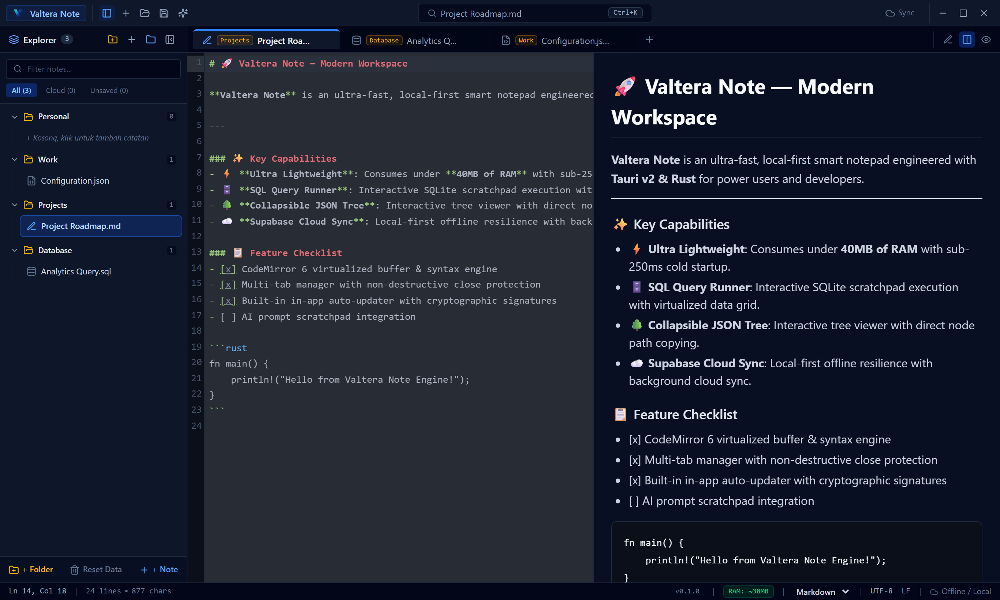
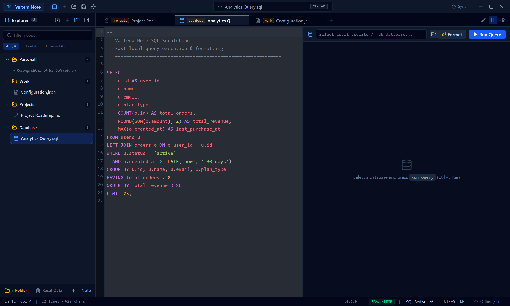
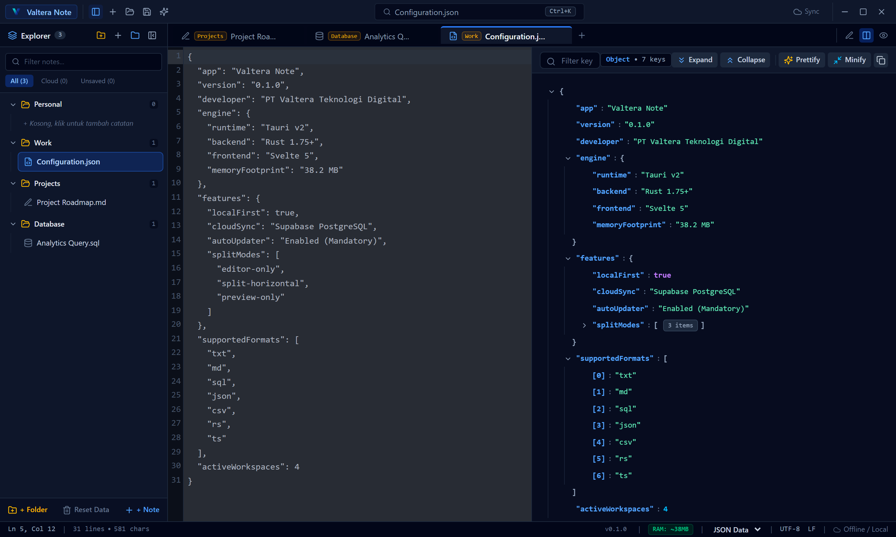

<div align="center">


# Valtera Note

**Ultra-lightweight, lightning-fast desktop text editor, SQL scratchpad, and Markdown workspace.**  
*Built with Tauri v2 & Rust — Consuming under 40MB of RAM.*

[](LICENSE)
[](https://v2.tauri.app)
[](https://www.rust-lang.org)
[](https://svelte.dev)
[](#-performance)
[](https://github.com/danikz/valtera-note/releases)

<br />

<p align="center">
  
</p>

</div>

---

## 📥 Download & Installation

Download the installer for your operating system directly from the **[GitHub Releases Page](https://github.com/danikz/valtera-note/releases/latest)**:

| Platform | Format | Installer File |
| :--- | :--- | :--- |
| **Windows 10 / 11** | `.exe` (Setup) | [**Valtera Note_0.1.0_x64-setup.exe**](https://github.com/danikz/valtera-note/releases/latest) |
| **Windows (Enterprise)** | `.msi` (WiX) | [**Valtera Note_0.1.0_x64_en-US.msi**](https://github.com/danikz/valtera-note/releases/latest) |
| **macOS (Apple Silicon & Intel)** | `.dmg` | [**Valtera Note_0.1.0_universal.dmg**](https://github.com/danikz/valtera-note/releases/latest) |
| **Linux (Ubuntu / Debian)** | `.deb` | [**valtera-note_0.1.0_amd64.deb**](https://github.com/danikz/valtera-note/releases/latest) |
| **Linux (Universal)** | `.AppImage` | [**valtera-note_0.1.0_amd64.AppImage**](https://github.com/danikz/valtera-note/releases/latest) |

> 🔄 **Automatic Updates**: Valtera Note includes a built-in auto-updater. When a new version is released, you will automatically get an in-app update notification with 1-click install.

---

## 💡 Why Valtera Note?

Most modern editors (VS Code, Obsidian, Notion) are built on **Electron**, consuming **400MB to 1GB+ of RAM** just to edit a quick text file. Classic Notepad is lightweight but lacks tabs, live viewers, and syntax formatting.

- ⚡ **Instant Startup**: Cold boot in `< 250ms` and idle memory usage **under 40MB**.
- 📑 **Live Markdown Split**: GitHub Flavored Markdown (GFM) with synchronized scrolling.
- 🗄️ **SQL Scratchpad**: Syntax highlighting, query beautifier, and local SQLite execution.
- 🌳 **Interactive JSON Tree**: Expandable node tree with type badges and click-to-copy paths.
- ☁️ **Local-First & Cloud Sync**: 100% offline-ready with optional Supabase cloud backup.
- 🪟 **Windows Explorer Integration**: Open files with 1-click from Windows context menu.

---

## ✨ Features & Previews

### 1. 🗄️ SQL Scratchpad & Formatter
Run queries against local SQLite databases, format messy SQL code, and explore query results in a clean grid viewer.

<p align="center">
  
</p>

### 2. 🌳 Collapsible JSON Tree Viewer
Inspect complex JSON payloads with collapsible tree nodes, data type badges, and instant path copying.

<p align="center">
  
</p>

---

## ⌨️ Keyboard Shortcuts

| Action | Shortcut |
| :--- | :--- |
| **Command Palette** | `Ctrl + K` / `Ctrl + P` |
| **New Note / Tab** | `Ctrl + N` |
| **Open File** | `Ctrl + O` |
| **Save Document** | `Ctrl + S` |
| **Close Tab** | `Ctrl + W` |
| **Toggle Sidebar** | `Ctrl + B` |
| **Toggle Split View** | `Ctrl + \` |
| **Toggle Reader Mode** | `Ctrl + Shift + P` |
| **Quick Snippets** | `Ctrl + Shift + S` |
| **Execute SQL Query** | `Ctrl + Enter` / `F5` |
| **Format SQL / JSON** | `Ctrl + Shift + F` |
| **Supabase Cloud Sync** | `Ctrl + Shift + U` |

---

## ☁️ Cloud Sync (Optional)

Valtera Note works 100% offline out-of-the-box. If you want multi-device synchronization:

1. Create a free project at [supabase.com](https://supabase.com).
2. Open **Valtera Note** ➔ Click **Cloud Sync (☁️)** in the Titlebar or press `Ctrl+Shift+U`.
3. Enter your **Project URL** & **Anon Key**, then sign up or log in.

---

## 🛠️ Building from Source

```bash
# 1. Clone repository
git clone https://github.com/danikz/valtera-note.git
cd valtera-note

# 2. Install dependencies & run dev
pnpm install
pnpm tauri dev

# 3. Build native installer
pnpm tauri build
```

---

## 📄 License

Distributed under the **MIT License**. See [`LICENSE`](LICENSE) for details.

<div align="center">
  <sub>Made with ❤️ by <b>PT Valtera Teknologi Digital</b></sub>
</div>
