# Appwrite Integration & Self-Hosting Guide — Valtera Note

Valtera Note is designed as a **Local-First, Cloud-Synced** open-source application. Users can operate 100% offline using the local SQLite engine, or connect to **any self-hosted or cloud Appwrite instance** to synchronize their notes, snippets, and workspaces seamlessly across multiple devices.

---

## 1. Sync Architecture (Local-First + Rust Background Sync)

To keep RAM below 50MB, the Appwrite synchronization engine runs inside the **Rust Native Backend** (via asynchronous `tokio` tasks and `reqwest`), keeping the frontend WebView light and free of heavy sync loop overhead.

```mermaid
sequenceDiagram
    autonumber
    actor User
    participant Frontend as Frontend (Svelte 5)
    participant LocalDB as Local SQLite (rusqlite)
    participant RustSync as Rust Sync Engine (Tauri Core)
    participant Appwrite as Self-Hosted Appwrite Backend

    User->>Frontend: Creates/Edits Note
    Frontend->>LocalDB: Instant Save (Local First, 0ms latency)
    LocalDB-->>RustSync: Mark as sync_status: 'pending'
    
    rect rgb(30, 40, 60)
        Note over RustSync,Appwrite: Background Non-blocking Sync
        RustSync->>Appwrite: Check Network & Auth Session
        RustSync->>Appwrite: Push Pending Changes (Upsert)
        Appwrite-->>RustSync: 200 OK + Updated Remote Timestamp
        RustSync->>LocalDB: Update sync_status: 'synced'
        RustSync->>Appwrite: Pull Remote Changes since last_synced_at
        Appwrite-->>RustSync: List of Updated Documents
        RustSync->>LocalDB: Upsert Remote Changes (Last-Write-Wins)
        RustSync->>Frontend: Emit Event: 'sync-completed'
    end
```



---

## 2. Appwrite Database & Collections Schema

Database ID: `valtera_note_db`

### Collection 1: `workspaces`
Permissions: `Users` (Create), `User:owner` (Read, Update, Delete)

| Attribute | Type | Size / Format | Required | Default | Description |
| :--- | :--- | :--- | :--- | :--- | :--- |
| `user_id` | String | 36 | Yes | - | Owner user ID |
| `name` | String | 255 | Yes | - | Workspace display name |
| `icon` | String | 50 | No | `folder` | Workspace icon name |
| `settings_json` | String | 5000 | No | `{}` | Workspace specific settings |
| `is_deleted` | Boolean | - | Yes | `false` | Soft delete flag |
| `client_updated_at` | DateTime | - | Yes | - | Last modification timestamp |

---

### Collection 2: `notes` (Documents / Scratchpads)
Permissions: `Users` (Create), `User:owner` (Read, Update, Delete)

| Attribute | Type | Size / Format | Required | Default | Description |
| :--- | :--- | :--- | :--- | :--- | :--- |
| `user_id` | String | 36 | Yes | - | Owner user ID |
| `workspace_id` | String | 36 | No | null | Parent Appwrite Workspace ID |
| `title` | String | 255 | Yes | `Untitled` | Note title |
| `content` | String | 1000000 | Yes | `""` | Note text / Markdown / SQL content |
| `file_extension` | String | 30 | Yes | `md` | `md`, `sql`, `txt`, `json`, `csv` |
| `is_pinned` | Boolean | - | Yes | `false` | Pin status |
| `tags` | String[] | 50 | No | `[]` | Category tags |
| `is_deleted` | Boolean | - | Yes | `false` | Soft delete flag |
| `client_updated_at` | DateTime | - | Yes | - | Client modification timestamp |

---

### Collection 3: `snippets`
Permissions: `Users` (Create), `User:owner` (Read, Update, Delete)

| Attribute | Type | Size / Format | Required | Default | Description |
| :--- | :--- | :--- | :--- | :--- | :--- |
| `user_id` | String | 36 | Yes | - | Owner user ID |
| `title` | String | 255 | Yes | - | Snippet title |
| `language` | String | 50 | Yes | `sql` | `sql`, `markdown`, `rust`, etc. |
| `category` | String | 100 | No | `general` | Category classification |
| `content` | String | 500000 | Yes | - | Snippet query or template code |
| `is_favorite` | Boolean | - | Yes | `false` | Bookmark flag |
| `is_deleted` | Boolean | - | Yes | `false` | Soft delete flag |
| `client_updated_at` | DateTime | - | Yes | - | Client modification timestamp |

---

### Collection 4: `user_settings`
Permissions: `Users` (Create), `User:owner` (Read, Update, Delete)

| Attribute | Type | Size / Format | Required | Default | Description |
| :--- | :--- | :--- | :--- | :--- | :--- |
| `user_id` | String | 36 | Yes | - | Owner user ID |
| `settings_json` | String | 20000 | Yes | `{}` | Theme, font, keybindings, etc. |
| `client_updated_at` | DateTime | - | Yes | - | Client modification timestamp |

---

## 3. End-User Configuration (App UI)

Users can configure sync via **Settings -> Cloud Sync (Appwrite)**:

1. **Server Endpoint**: `https://cloud.appwrite.io/v1` or `https://appwrite.yourdomain.com/v1`
2. **Project ID**: `valtera-note-prod`
3. **Authentication**:
   - Email & Password (Login / Register)
   - Magic URL (Passwordless)
   - Anonymous Mode (Temporary device sync)
   - Optional: Client-side Master Password for Zero-Knowledge End-to-End Encryption (E2EE AES-256-GCM before pushing to Appwrite).

---

## 4. Self-Hosting Appwrite (Docker Compose Snippet)

For community members deploying their own Appwrite backend:

```yaml
version: '3.8'

services:
  appwrite:
    image: appwrite/appwrite:1.6.0
    container_name: appwrite
    restart: unless-stopped
    ports:
      - "80:80"
      - "443:443"
    environment:
      - _APP_ENV=production
      - _APP_OPENSSL_KEY_V1=your-secret-openssl-key-at-least-32-chars
      - _APP_DOMAIN=note.yourdomain.com
      - _APP_DOMAIN_TARGET=note.yourdomain.com
      - _APP_REDIS_HOST=redis
      - _APP_DB_HOST=mariadb
      - _APP_DB_USER=appwrite
      - _APP_DB_PASS=your-database-password
      - _APP_DB_SCHEMA=appwrite
    volumes:
      - appwrite-uploads:/storage/uploads
      - appwrite-certificates:/storage/certificates
    depends_on:
      - redis
      - mariadb

  mariadb:
    image: mariadb:10.11
    container_name: appwrite-mariadb
    restart: unless-stopped
    environment:
      - MYSQL_ROOT_PASSWORD=rootpassword
      - MYSQL_DATABASE=appwrite
      - MYSQL_USER=appwrite
      - MYSQL_PASSWORD=your-database-password
    volumes:
      - appwrite-mariadb:/var/lib/mysql

  redis:
    image: redis:7.0-alpine
    container_name: appwrite-redis
    restart: unless-stopped
    volumes:
      - appwrite-redis:/data

volumes:
  appwrite-uploads:
  appwrite-certificates:
  appwrite-mariadb:
  appwrite-redis:
```
