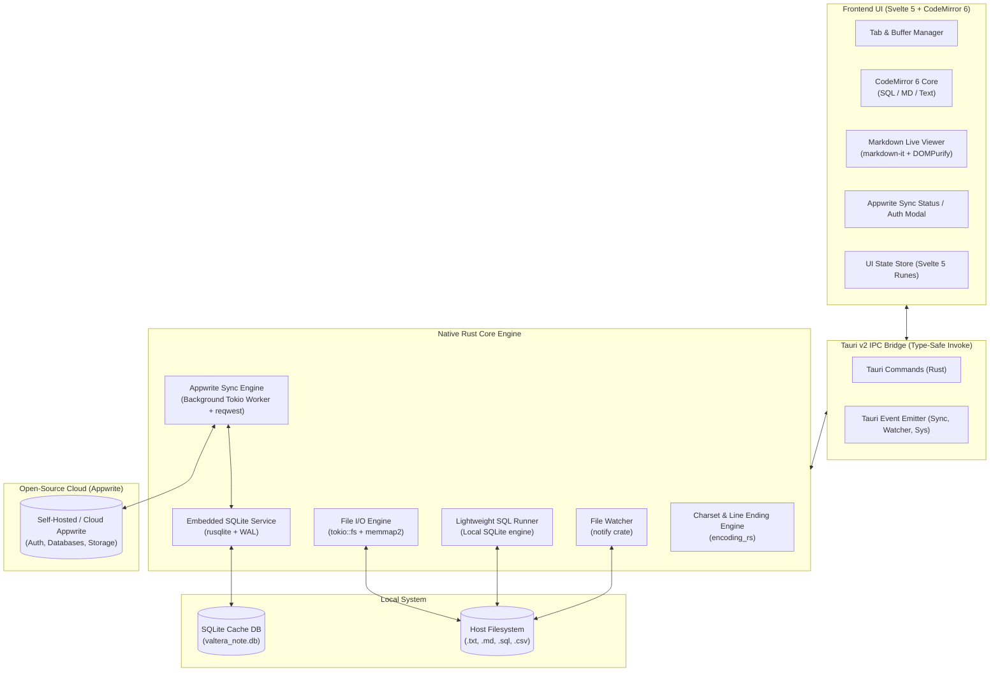

# System Architecture & Technical Design — Valtera Note

## 1. High-Level Architecture Overview

Valtera Note uses **Tauri v2** with a compiled **Rust backend**, a zero-overhead **Svelte 5 frontend**, and an optional **Appwrite Open-Source Sync Engine**.



---

## 2. Technology Stack & Rationale

| Layer | Selected Tech | Rationale for Ultra-Low RAM & Speed |
| :--- | :--- | :--- |
| **Desktop Framework** | **Tauri v2** (Rust) | Replaces Electron. Uses OS native webview (WebView2 on Windows, WebKitGTK on Linux). Zero bundled Chromium engine (~15MB installer vs 90MB+ Electron). |
| **Frontend Framework** | **Svelte 5** (Runes) | Zero Virtual DOM overhead, compiled fine-grained reactivity. Minimal JS runtime (~20KB minified). |
| **CSS Framework** | **Tailwind CSS v4** | Pure static atomic CSS compiled ahead of time. Zero runtime JS style calculation. |
| **Editor Engine** | **CodeMirror 6** | Modular, DOM-virtualized text editor. Uses only **4-8MB RAM** compared to Monaco Editor's 40-70MB footprint. |
| **Markdown Parser** | **markdown-it** + **DOMPurify** | Fast synchronous parser with zero heavy dependency tree; safe XSS sanitization. |
| **Local Database** | **SQLite 3** (via `rusqlite`) | Embedded C-native DB, WAL mode, memory consumption < 2MB. |
| **Cloud Sync & BaaS** | **Supabase** (Self-Hosted or Cloud) | Open Source Backend-as-a-Service with built-in GoTrue Auth, PostgreSQL DB, and REST/Realtime API. Anyone can deploy via Docker or use Supabase Cloud. |
| **Sync Engine Layer** | **Rust Async Worker (`reqwest` + `tokio`)** | Runs sync in background native threads; zero Webview CPU/RAM lag. |

---

## 3. Supabase Sync Engine Design

### 3.1. Why Sync in Rust instead of Frontend JS?
Running heavy network sync loops, token refreshing, and JSON diffing in the frontend Webview increases memory pressure and can cause frame drops during fast typing. By moving the Supabase REST client into Rust:
1. Webview stays clean (< 40MB RAM).
2. Sync occurs in background asynchronous tasks (`tokio::spawn`).
3. Offline queue persists in SQLite even if the app crashes.

### 3.2. Sync Workflow
1. User writes a note $\rightarrow$ Saved locally to SQLite (`sync_status = 'pending'`).
2. Debounce timer (3s) fires in Rust.
3. Rust calls Supabase PostgREST API:
   - Push: Upsert changed records to Supabase `notes` table with Row-Level Security.
   - Pull: Fetch remote records modified after `synced_at`.
4. Update local SQLite status to `synced` and notify frontend via Tauri Event `sync:status-changed`.

---

## 4. Tauri IPC Command API Contract

### 4.1. File Operations (`src-tauri/src/commands/fs.rs`)
```rust
#[tauri::command]
async fn read_file_content(path: String) -> Result<FilePayloadDto, String>;

#[tauri::command]
async fn write_file_content(
    path: String, 
    content: String, 
    encoding: Option<String>,
    line_ending: Option<String>
) -> Result<FileSaveResultDto, String>;
```

### 4.2. Supabase Auth & Sync Commands (`src-tauri/src/commands/supabase.rs`)
```rust
// Get Supabase credentials
#[tauri::command]
async fn get_supabase_config() -> Result<SupabaseConfigDto, String>;

// Save Supabase credentials
#[tauri::command]
async fn save_supabase_config(url: String, anon_key: String) -> Result<(), String>;

// Test connection
#[tauri::command]
async fn test_supabase_connection(url: String, anon_key: String) -> Result<String, String>;

// Login with email & password
#[tauri::command]
async fn supabase_login(url: String, anon_key: String, email: String, password: String) -> Result<String, String>;
```

---

## 5. Directory Layout (Full Monorepo)

```
valtera-note/
├── docs/                         # Specification & Blueprints
│   ├── PRD.md
│   ├── ARCHITECTURE.md
│   ├── SCHEMA.dbml
│   ├── DATABASE.md
│   ├── APPWRITE_SETUP.md         # Appwrite collections, permissions, & self-host docker
│   └── AI_DEVELOPMENT_GUIDE.md
├── src/                          # Svelte 5 Frontend
│   ├── components/
│   │   ├── Titlebar/
│   │   ├── Tabs/
│   │   ├── Editor/               # CodeMirror 6 core
│   │   ├── Viewer/               # Markdown & Data viewer
│   │   ├── Sync/                 # Appwrite Sync UI & Login modal
│   │   └── StatusBar/
│   ├── stores/                   # Svelte 5 Runes stores
│   └── services/                 # Tauri IPC wrappers
├── src-tauri/                    # Rust Tauri Core
│   ├── src/
│   │   ├── commands/             # fs, session, sql, appwrite
│   │   ├── db/                   # SQLite database migrations & repos
│   │   ├── services/             # File I/O, sync engine, encoding
│   │   └── appwrite/             # Appwrite REST client in Rust
│   └── Cargo.toml
├── package.json
└── README.md
```
