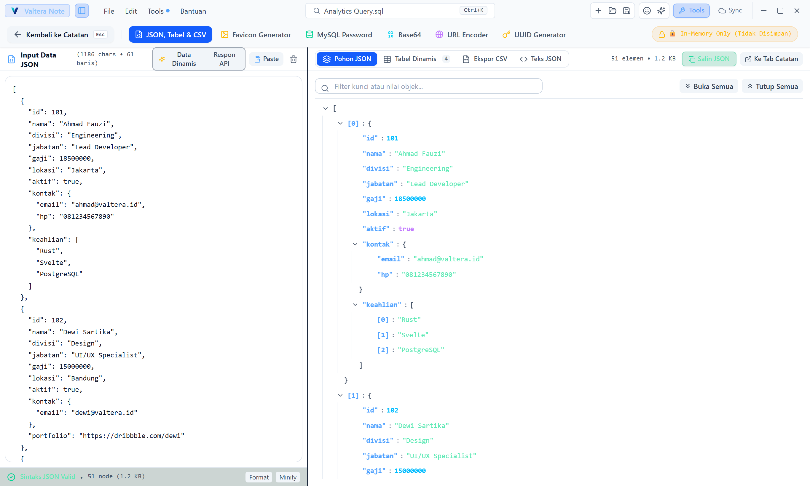
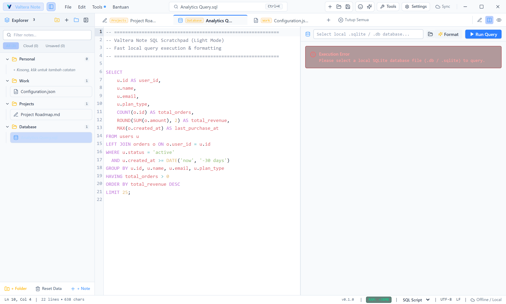
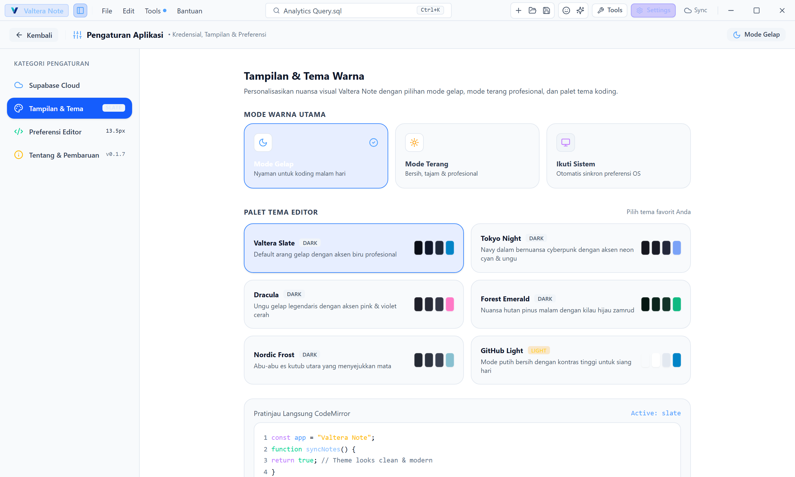
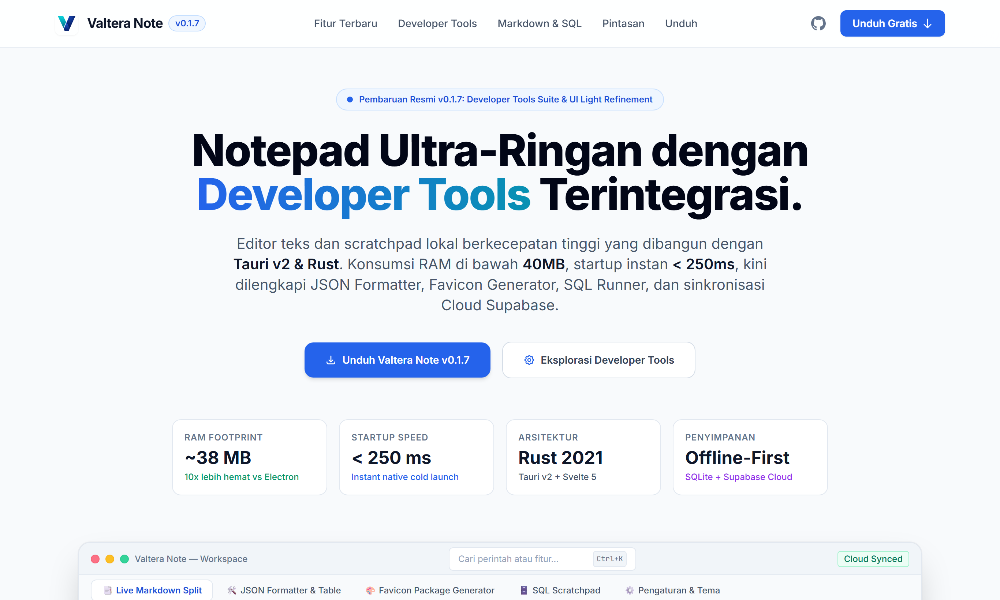

# ✨ Features & Previews — Valtera Note

Tur lengkap fitur Valtera Note dengan screenshot (Light Mode, dirender otomatis via Playwright).

---

## 1. 🛠️ Dedicated Developer Tools Suite & SQLite Studio (`v0.1.9`)

Access full-page developer utilities directly via the Titlebar button, Command Palette (`Ctrl+K`), or keyboard shortcuts:

- **JSON Formatter & Tree Inspector** (`Ctrl+Shift+J`): Beautify, minify, and inspect JSON payloads with interactive tree navigation or dynamic table grids. Export to **CSV (RFC 4180)** and **Markdown Tables** with 1-click.
- **Pembaca SQLite & Database Explorer (SQLite Studio)** (`Ctrl+Shift+D`): Buka dan jelajahi berkas database SQLite (`.db`, `.sqlite`, `.sqlite3`) dari komputer atau database internal Valtera Note dengan 1-klik. Tampilkan daftar tabel & views, hitung baris, sortir kolom, filter pencarian baris real-time, eksekusi query SQL custom, dan ekspor ke CSV, JSON, atau Markdown Table.
- **Favicon & Web Icon Package Generator** (`Ctrl+Shift+F`): Drag and drop any image or SVG to generate `favicon.ico` (multi-res 16/32/48), `apple-touch-icon.png`, `android-chrome-192/512`, `manifest.json`, `browserconfig.xml`, and a ready-to-download ZIP archive.
- **MySQL Password Hash Generator** (`Ctrl+Shift+P`): Compute MySQL Native Password (`mysql_native_password` double-SHA1) and legacy hashes for quick database administration.
- **Base64 & URL Tools**: Bilateral Base64 encoding/decoding and URL query parameter inspector.
- **Bulk UUID v4 Generator**: Fast bulk UUID generation with capitalization and format options.

<p align="center">
  
</p>

---

## 2. 🤖 AI Assistant & Chat Sidebar (`v0.1.18+`)

Chat dengan AI langsung di dalam editor:

- **Provider bebas (BYO key)**: Anthropic Claude (native), OpenAI, OpenRouter, Groq, atau Ollama lokal. Key tersimpan hanya di perangkat.
- **Context-aware**: AI membaca catatan aktif dan/atau teks yang kamu seleksi di editor.
- **Write-to-note**: minta AI menulis/mengubah isi catatan — terapkan dengan satu klik.
- **Quick actions**: Ringkas, Perbaiki Tulisan, Translate, Jelaskan, Commit Message, prompt kustom.

<p align="center">
  <em>AI Chat Sidebar — konteks catatan aktif & teks terpilih</em>
</p>

📖 Panduan lengkap: **[AI_ASSISTANT.md](AI_ASSISTANT.md)**

---

## 3. 🔒 End-to-End Encryption & Lock Screen (`v0.1.11+`)

- Konten catatan dienkripsi **XChaCha20-Poly1305** (kunci diturunkan dari master password via **Argon2id**, parameter OWASP) sebelum disimpan ke SQLite lokal maupun disinkronkan ke Supabase.
- **Lock Screen** muncul saat app dibuka; opsi "Ingat di Device Ini" menyimpan kunci di **Windows Credential Manager** (macOS Keychain / Linux Secret Service) untuk auto-unlock.
- Cloud sync memakai **Row Level Security ketat** — hanya akun yang login yang bisa mengakses tabelnya.

---

## 4. 🗄️ SQL Scratchpad & Local SQLite Execution

Run queries against local SQLite databases, format messy SQL code, and explore query results in a responsive data grid viewer:

<p align="center">
  
</p>

---

## 5. 📑 Live Markdown Split & Inline Emoji Autocomplete

Write documentation with dual-pane real-time rendering. Type `:` to trigger inline emoji autocomplete (`:rocket:`, `:star:`, `:check:`, `:warn:`, `:db:`), or press `Ctrl+Shift+E` for the visual emoji picker modal:

<p align="center">
  
</p>

---

## 6. ⚙️ Unified Settings Workspace & Multi-Theme (`Ctrl+,`)

Pusat konfigurasi terpadu dengan sidebar navigasi yang rapi dan elegan:

- **Supabase Cloud Sync**: Kredensial → Status Tabel → Akun, dengan urutan setup bernomor, skrip SQL resmi (RLS ketat), dan auto-setup 1-klik.
- **AI Assistant**: provider (Claude / OpenAI-compatible / Ollama), API key, dan model dengan daftar model otomatis dari provider.
- **Tampilan & Tema (Dark / Light / System)**: 6 palet tema koding (*Valtera Slate*, *Tokyo Night*, *Dracula*, *Forest Emerald*, *Nordic Frost*, *GitHub Light*) dengan pratinjau langsung CodeMirror, plus **zona waktu tampilan** yang bisa diatur (format 24 jam).
- **Preferensi Tipografi Editor**: ukuran font dinamis, jenis font koding (*JetBrains Mono, Fira Code, Cascadia Code, Menlo*), ukuran indentasi tab, dan jeda auto-save.
- **Tentang & Pembaruan**: informasi sistem dan pemeriksa pembaruan rilis 1-klik.

<p align="center">
  
</p>

---

## 7. 🌐 Interactive Feature Documentation & Showcase Page

Valtera Note includes a dedicated, responsive feature showcase page located at [`docs/index.html`](index.html):

<p align="center">
  
</p>

---

## 📸 Automated Screenshot Capture

Screenshots are automatically captured in high-resolution Light Mode using Playwright:

```bash
node scripts/capture-light-screenshots.mjs
```

Output images are saved to `docs/screenshots/` at 2x device scale for high-DPI displays.
