# Supabase Integration & Self-Hosting Guide — Valtera Note

Valtera Note is designed as a **Local-First, Cloud-Synced** open-source application. Users can operate 100% offline using the local SQLite engine, or connect to **any cloud or self-hosted Supabase instance** (PostgreSQL + PostgREST + GoTrue Auth) to synchronize notes, SQL scripts, and workspaces seamlessly across multiple devices.

---

## 1. Sync Architecture (Local-First + Rust Engine)

To maintain ultra-low RAM usage (< 40MB RAM), synchronization runs inside the **Rust Native Backend** (`tokio` + `reqwest`), keeping the frontend free of heavy sync loops.

```mermaid
sequenceDiagram
    autonumber
    actor User
    participant Frontend as Frontend (Svelte 5)
    participant LocalDB as Local SQLite (rusqlite)
    participant RustSync as Rust Sync Engine (Tauri Core)
    participant Supabase as Supabase (PostgreSQL + PostgREST)

    User->>Frontend: Creates/Edits Note
    Frontend->>LocalDB: Instant Save (Local First, 0ms latency)
    LocalDB-->>RustSync: Mark as sync_status: 'pending'
    
    rect rgb(20, 45, 35)
        Note over RustSync,Supabase: Background Non-blocking Sync
        RustSync->>Supabase: Check Network & Auth Token
        RustSync->>Supabase: POST /rest/v1/notes (Upsert with RLS)
        Supabase-->>RustSync: 200 OK + Updated Remote Timestamp
        RustSync->>LocalDB: Update sync_status: 'synced'
        RustSync->>Supabase: GET /rest/v1/notes?updated_at=gt.last_sync
        Supabase-->>RustSync: List of Updated Documents
        RustSync->>LocalDB: Upsert Remote Changes (Last-Write-Wins)
        RustSync->>Frontend: Emit Event: 'sync-completed'
    end
```



---

## 2. Supabase Database Schema (PostgreSQL DDL)

Jalankan skrip SQL berikut di **Supabase Dashboard ➡️ SQL Editor**:

```sql
-- 1. Create notes table
create table if not exists public.notes (
    id uuid default gen_random_uuid() primary key,
    user_id uuid references auth.users(id) on delete cascade not null,
    title text not null default 'Untitled',
    content text not null default '',
    file_extension text not null default 'md',
    is_pinned boolean not null default false,
    is_deleted boolean not null default false,
    created_at timestamp with time zone default timezone('utc'::text, now()) not null,
    updated_at timestamp with time zone default timezone('utc'::text, now()) not null
);

-- 2. Create indices for high-performance sync
create index if not exists idx_notes_user_id on public.notes(user_id);
create index if not exists idx_notes_updated_at on public.notes(updated_at desc);

-- 3. Enable Row-Level Security (RLS)
alter table public.notes enable row level security;

-- 4. Create RLS Policies (Users can only access their own notes)
create policy "Users can view own notes"
    on public.notes for select
    using (auth.uid() = user_id);

create policy "Users can insert own notes"
    on public.notes for insert
    with check (auth.uid() = user_id);

create policy "Users can update own notes"
    on public.notes for update
    using (auth.uid() = user_id)
    with check (auth.uid() = user_id);

create policy "Users can delete own notes"
    on public.notes for delete
    using (auth.uid() = user_id);

-- 5. Auto-update updated_at timestamp trigger
create or replace function public.handle_updated_at()
returns trigger as $$
begin
    new.updated_at = now();
    return new;
end;
$$ language plpgsql;

create trigger on_notes_updated
    before update on public.notes
    for each row
    execute function public.handle_updated_at();
```

---

## 3. Cara Menghubungkan Valtera Note ke Supabase

1. Buka [https://supabase.com](https://supabase.com) dan buat project baru (atau jalankan Supabase lokal).
2. Di **Supabase Dashboard**:
   - Buka menu **Project Settings** ➡️ **API**.
   - Salin **Project URL** (misal: `https://xyzcompany.supabase.co`).
   - Salin **anon public key** (`eyJhbGciOiJI...`).
3. Di aplikasi **Valtera Note**:
   - Klik tombol **Sync (☁️)** di Titlebar.
   - Masukkan **Project URL** dan **Anon Key**.
   - Klik tombol **"Test Connection"** untuk memastikan koneksi berhasil.
   - Masukkan Email & Password pada tab **Sign Up** atau **Login**.
   - Klik **Connect**!
